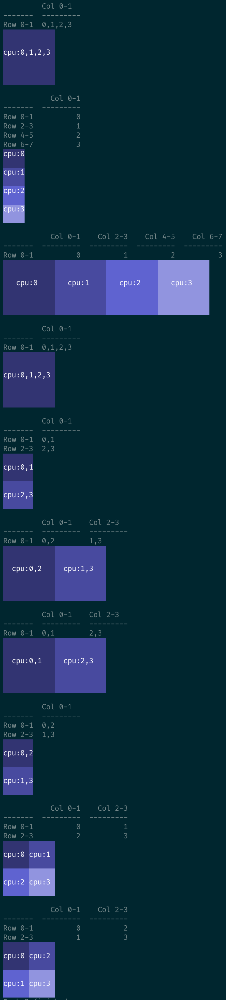

# Visualizing PyTorch DTensor Sharding Like JAX

Since transitioning from the PyTorch Distributed team at Meta to working on Apple Foundation Models at Apple, I've been utilizing [AXLearn](https://github.com/google/axlearn), which is built on top of JAX.

To understand JAX's distributed arrays and how sharding across a device mesh could implement various parallelism strategies, I've used `jax.debug.visualize_array_sharding`. In this [LinkedIn post](https://www.linkedin.com/posts/yidewang_i-coauthored-this-notebook-with-wanchao-activity-7319523841595076608-bcm3?utm_source=share&utm_medium=member_desktop&rcm=ACoAAALdDjQBRj38KfRE5-nY27SqXVIIS8171vE), co-authored with Wanchao Liang, we demonstrate the benefits of visualizing sharding.

It's encouraging to see my former team releasing PyTorch's DTensor and showcasing its value through the development of FSDP2 and TorchTitan. DTensor also includes a sharding visualization feature that utilizes `tabulate` to produce a basic visual representation.

This project introduces an enhanced visualization for DTensor's sharding, inspired by JAX's approach.

## Installation

Install the project using the following command:

```bash
pip install -e .
```

Execute tests with:

```shell
OMP_NUM_THREADS=1 torchrun --nproc_per_node=4 visualize_pytorch_dtensor_sharding_like_jax.py
```

This will display a list of sharding/mesh combinations. For each combination, visualizations generated by both the original and the new methods will be presented.


